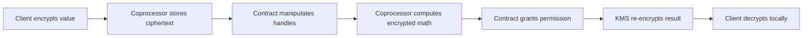
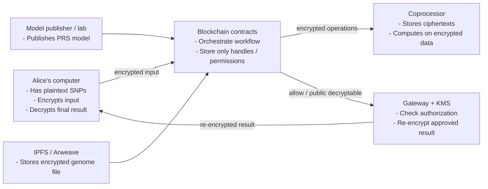

# bioETH PRS - Architecture and Concepts Cheat Sheet

This document summarizes the key concepts, components, and flows covered in the onboarding guide. It is intended as a quick reference for engineers joining the project.

## 1. Core Domain Concepts

### Genome

A genome is the full DNA sequence of a person.

For PRS systems, the full genome is not used directly. Instead, specific positions called SNPs are extracted.

### SNP (Single Nucleotide Polymorphism)

A SNP is a position in the genome where variation occurs between individuals.

Example:

```text
Position 1000:
Person A: A
Person B: G
```

For PRS models, SNPs are encoded numerically as dosages:

```text
0 = no risk allele
1 = one copy of risk allele
2 = two copies of risk allele
```

Example SNP vector:

```text
[0, 1, 2, 0, 1, ...]
```

### GWAS (Genome-Wide Association Study)

A GWAS identifies correlations between SNPs and diseases.

It produces weights indicating how much each SNP contributes to disease risk.

Example model weights:

```text
SNP1 weight = 0.0045
SNP2 weight = -0.0021
SNP3 weight = 0.0178
```

### PRS (Polygenic Risk Score)

PRS estimates genetic disease risk using a weighted sum of SNPs.

Formula:

```text
PRS = sum(SNP_i * weight_i)
```

Example:

```text
SNP vector:    [0, 1, 2]
Model weights: [4, 3, 5]
PRS = 0*4 + 1*3 + 2*5 = 13
```

The system computes this score while keeping genome data encrypted.

## 2. Why Privacy Is Needed

Genomic data is extremely sensitive.

If a genome becomes public, it can reveal:

- Disease risks
- Ancestry
- Familial relationships

The system goal is to compute PRS without exposing:

- The genome
- Potentially the model weights
- Intermediate results

This is achieved using homomorphic encryption.

## 3. Homomorphic Encryption

Homomorphic encryption allows computation on encrypted data.

Example:

```text
Enc(2) + Enc(3) = Enc(5)
```

The system does not need to decrypt inputs during computation.

Only authorized outputs are decrypted later.

## 4. fhEVM Overview

fhEVM is a blockchain runtime that supports encrypted computation.

It adds:

- Encrypted integer types
- Homomorphic operations
- Ciphertext access control
- Secure decryption infrastructure

Encrypted values appear in Solidity as types such as:

```solidity
euint64
```

## 5. Ciphertext Handles

Important concept: the blockchain does not store encrypted blobs directly.

Instead it stores a handle that references ciphertext stored in the encrypted runtime.

Example:

```text
Contract storage:
scoreHandle = 0x8fa2

Coprocessor storage:
0x8fa2 -> encrypted blob representing value
```

Contracts manipulate handles, not raw ciphertext.

## 6. Major System Components

The system consists of several cooperating components.

### Client (Alice)

Responsibilities:

- Convert genome to SNP vector
- Encrypt SNP values
- Submit encrypted inputs
- Decrypt final result

Plaintext only exists on the client.

### Blockchain Contracts

Smart contracts orchestrate the workflow.

Main contracts:

```text
GenomicRegistry
ModelMarketplace
PRSComputeEngine
ResultOracle
```

They store:

- Job state
- Ciphertext handles
- Permissions
- Metadata

They never see plaintext values.

### Coprocessor

The coprocessor performs encrypted computation.

Responsibilities:

- Store ciphertext objects
- Perform homomorphic operations
- Return handles for result ciphertexts

Example operation:

```text
Enc(2) * 5 -> Enc(10)
```

The coprocessor only sees ciphertext.

### FHE Precompiles

Precompiles connect Solidity to encrypted operations.

Example call:

```solidity
FHE.add(a, b)
```

Runtime flow:

```text
contract -> precompile -> coprocessor -> new ciphertext -> new handle
```

### KMS (Key Management Service)

The KMS holds the secret decryption key.

Responsibilities:

- Decrypt outputs when authorized
- Perform ciphertext re-encryption

The KMS does not expose a public decrypt-anything interface.

Decryption only occurs when blockchain permissions allow it.

### Gateway

The gateway is the API layer between users and the KMS.

Responsibilities:

- Verify caller identity
- Check blockchain permissions
- Request re-encryption from KMS
- Deliver encrypted result to client

### Off-chain Storage

Large genome files are stored outside the blockchain.

Typical systems:

```text
IPFS
Arweave
Encrypted cloud storage
```

The blockchain stores only metadata and URI.

## 7. Access Control for Ciphertexts

Encrypted values have permissions.

Grant decryption rights to one address:

```solidity
FHE.allow(handle, address)
```

Example:

```solidity
FHE.allow(scoreHandle, aliceAddress)
```

Make a value publicly decryptable:

```solidity
FHE.makePubliclyDecryptable(handle)
```

This is typically used for safe outputs like risk category.

## 8. Quantization of Model Weights

PRS weights are floating-point values.

Homomorphic arithmetic in this pipeline is integer based.

Solution: quantization.

Steps:

1. Multiply by a scale factor.
2. Round to integer.
3. Encode negative numbers using an offset scheme when needed.

Example:

```text
0.004521 * 100000 -> 452
```

Now it can be stored and computed as an integer value.

## 9. Chunked Computation

Encrypted operations are expensive.

Block gas limits usually prevent processing very large SNP vectors in one transaction.

Solution: chunking.

Example:

```text
SNP vector size = 1000
chunk size = 50
```

Compute flow:

```text
startPRS()
computeChunk() repeated multiple times
finalize()
```

Each chunk processes part of the vector and updates encrypted partial sums.

## 10. Result Oracle

The oracle converts an encrypted PRS score into a risk category.

Steps:

1. Add noise to score.
2. Compare against thresholds.
3. Output category.

Example thresholds:

```text
Low risk: PRS < 100
Medium risk: 100 <= PRS < 150
High risk: PRS >= 150
```

Returning categories helps reduce model extraction attacks.

## 11. Full End-to-End Flow

1. Alice converts genome to SNP vector.
2. Alice encrypts SNP values locally.
3. Alice uploads encrypted genome to off-chain storage.
4. Alice registers metadata in GenomicRegistry.
5. Researcher publishes PRS model.
6. Alice starts PRS job.
7. computeChunk transactions process SNP batches.
8. finalize() returns encrypted PRS score.
9. ResultOracle classifies score.
10. Gateway retrieves authorized result.
11. KMS re-encrypts output.
12. Alice decrypts locally.

Plaintext appears only on Alice's device.

## 12. Data Location Summary

```text
Client:
- plaintext SNPs
- plaintext final result

Blockchain:
- handles
- job state
- permissions

Coprocessor:
- ciphertext blobs
- encrypted computation

KMS:
- decryption key
- re-encryption

Gateway:
- authorization checks
- result delivery

Off-chain storage:
- encrypted genome file
```

## 13. Key Takeaways

- Encrypted values are referenced by handles.
- Contracts orchestrate workflows but never see plaintext.
- Coprocessor performs encrypted math.
- KMS holds decryption capability but follows blockchain authorization.
- Gateway delivers outputs securely.
- The system enables privacy-preserving PRS computation.

## 14. Diagrams

### Minimal flow



### Component interaction map



### Full architecture and data flow

```mermaid
flowchart LR
    %% =========================
    %% Client side
    %% =========================
    subgraph Client["Client / Alice workstation"]
        A1["Plaintext genome / SNP vector<br/>[0,1,2,...]"]
        A2["fhevmjs encrypts with network public FHE key"]
        A3["Ciphertexts + proof"]
        A4["Ephemeral keypair for result retrieval<br/>(public key / private key)"]
        A5["Local decryption of re-encrypted result"]
        A6["Plaintext output<br/>e.g. High risk"]
        A1 --> A2 --> A3
        A4 --> A5 --> A6
    end

    %% =========================
    %% Blockchain side
    %% =========================
    subgraph Chain["fhEVM blockchain / validator network"]
        B1["GenomicRegistry<br/>sample metadata, owner, ACL, URI"]
        B2["ModelMarketplace<br/>PRS model weights / metadata"]
        B3["PRSComputeEngine<br/>job state, chunking, partialSum handle"]
        B4["ResultOracle<br/>noise + thresholds + category"]
        B5["FHE precompiles<br/>bridge Solidity calls to encrypted runtime"]
    end

    %% =========================
    %% Encrypted runtime side
    %% =========================
    subgraph Runtime["fhEVM encrypted runtime"]
        C1["Coprocessor<br/>stores ciphertext objects<br/>executes FHE add/mul/compare"]
        C2["Ciphertext handle store<br/>handle -> ciphertext blob"]
        C3["KMS<br/>holds network secret decryption key"]
        C4["Gateway<br/>authenticates caller, checks ACL, requests re-encryption"]
    end

    %% =========================
    %% Off-chain storage
    %% =========================
    subgraph Storage["Off-chain encrypted storage"]
        D1["IPFS / Arweave / cloud storage<br/>encrypted genome file"]
    end

    %% =========================
    %% Publish / register flow
    %% =========================
    A3 -- "optional encrypted genome upload" --> D1
    D1 -- "URI" --> B1

    %% =========================
    %% Input submission flow
    %% =========================
    A3 -- "transaction submits encrypted inputs" --> B3
    B3 -- "stores only handles in job state" --> B3
    B3 -- "encrypted ops: FHE.add / FHE.mul / FHE.compare" --> B5
    B5 --> C1
    C1 <--> C2

    %% =========================
    %% Model flow
    %% =========================
    B2 -- "model weights / modelId" --> B3

    %% =========================
    %% Oracle flow
    %% =========================
    B3 -- "final encrypted score handle" --> B4
    B4 -- "encrypted ops for noise + classification" --> B5

    %% =========================
    %% Permission / decryption flow
    %% =========================
    B3 -- "FHE.allow(scoreHandle, Alice)" --> C4
    B4 -- "FHE.makePubliclyDecryptable(categoryHandle)" --> C4

    A4 -- "signed request + ephemeral public key" --> C4
    C4 -- "check on-chain ACL / public decryptability" --> Chain
    C4 --> C3
    C3 -- "re-encrypt result to Alice ephemeral public key" --> C4
    C4 -- "re-encrypted ciphertext" --> A5

    %% =========================
    %% Notes via links
    %% =========================
    A2 -. "Uses network public key" .-> C3
    C1 -. "Never needs plaintext" .-> C3
    Chain -. "Contracts know workflow + permissions, not plaintext" .-> C2
```


